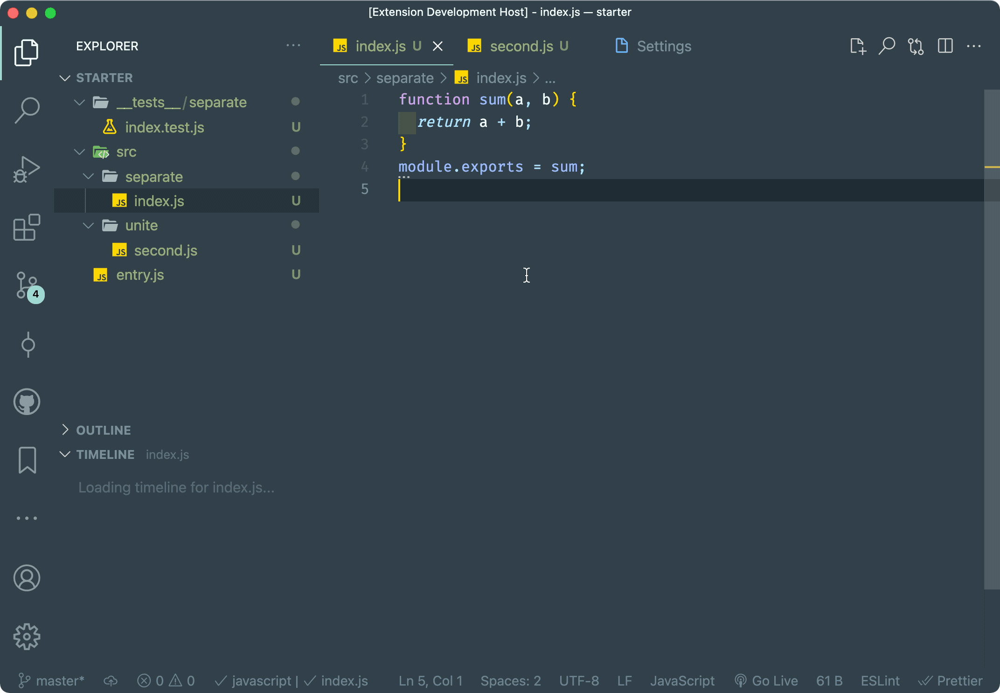
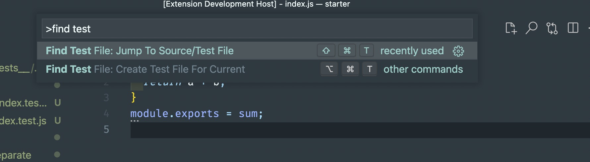
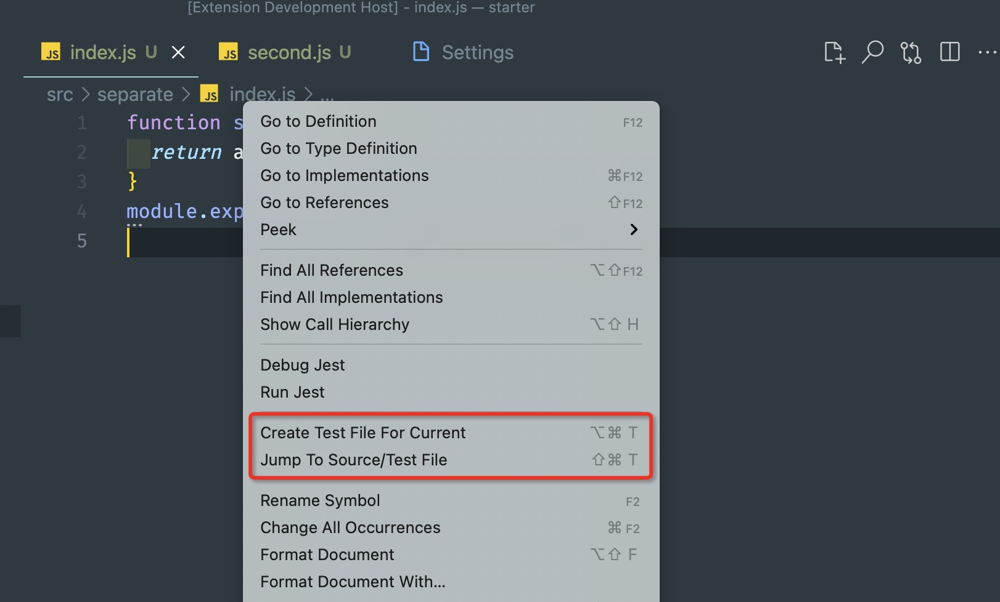
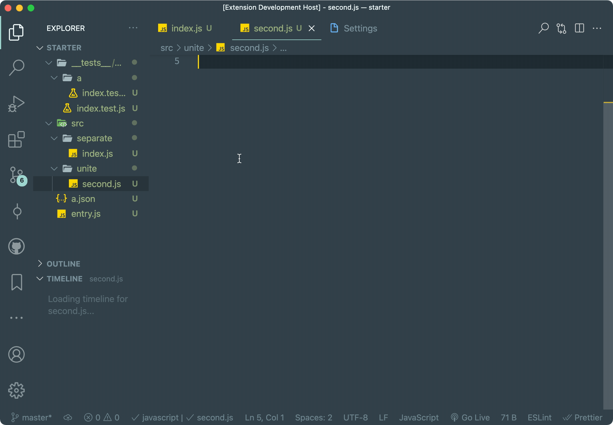
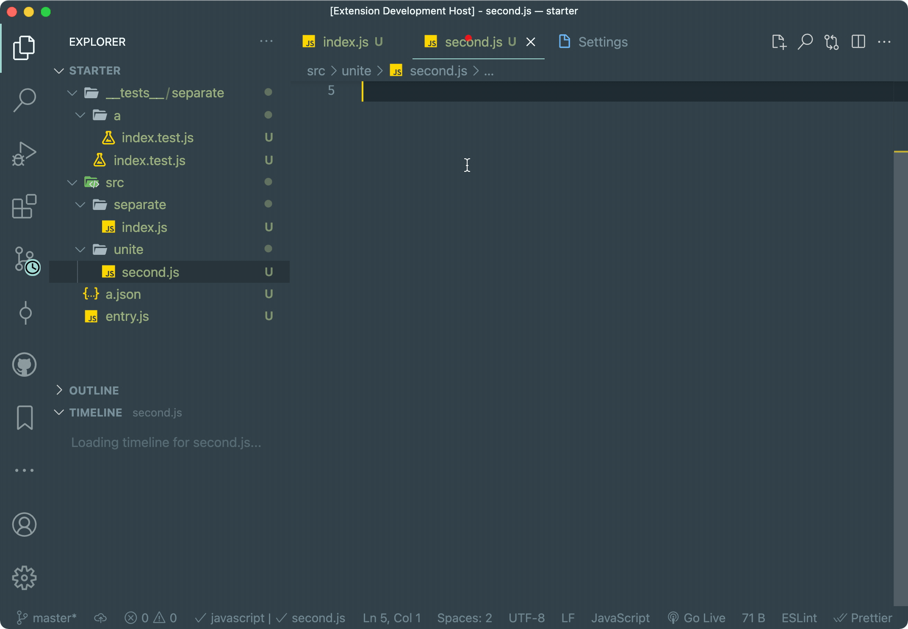

# Find Test File


[](https://github.com/wjgogogo/vscode-find-test-file/actions/workflows/publish.yml)

> a vscode extension to help you jump between source and test file easily! 💯

<p align="center">
  
</p>

## 🎉 Features

- jump between source and test file, show select component if there are several possible files.
- create a test file if can't find it.
  

## 🔖 Usage

extension provides 4 ways to help you switch source/test files or create test file.

when editor focus on a javascript or typescript file, you can:

1. open command palette, and input find test file, you can find two commands:
   
2. or you can find two icons in top right of editor:
   
3. or you can open context menu to find these two options:
   
4. or you can use shortcut:
   - findTestFile: `cmd+shift+t`(window: `ctrl+shift+t`)
   - createTestFile: `cmd+alt+t`(window: `ctrl+alt+t`)

### Principal

> if you want extension work as you expected

the extension will think source file and test file should have **the same basename and extension**. for example, if the source file is `a.ts`. then its test file should be `a@testSuffix.ts`.

### Language Support

Support for `.ts`, `.tsx`, `.js`, `.jsx`.

### Configuration

#### `findTestFile.basic.excludeFolder`

The folders are outside of the scan range. By default, it excludes `node_modules`. you can add other folders that you don't want extension to find source/test files(e.g. `dist`).

#### `findTestFile.basic.testSuffix`

The regexp patterns that extension uses to detect test files. By default, it looks for `.js`, `.jsx`, `.ts`, `.tsx` files with a suffix of `.spec` or `.test` (e.g. extension regards `example.spec.ts` or `example.test.js` as test file).

#### `findTestFile.createIfNotFind.enable`

Decide whether to create a test file when it can't be found. By default, it's `false`.

#### `findTestFile.createIfNotFind.insertSnippet`

Decide whether to insert code snippet. By default, it's `true`.

#### `findTestFile.createIfNotFind.preferStructureMode`

The preferred way to create a test file when can't find it and `findTestFile.createIfNotFind.enable` is enabled. By default, it's `separate`.

- `separate`: Put new test file in a separate folder, and follow the same directory structure of source file (e.g. the test file of `src/example/a.ts` should be `@separate-folder/example/a.spec.ts`).
- `unite`: Put new test file close to the source file (e.g. the test file of `src/example/a.ts` should be `src/example/@unite-folder/a.spec.ts`)."

#### `findTestFile.createIfNotFind.preferTestDirectory`

Determine the test folder structure when create test file. `separate` property only enable when `Find Test File › Create If Not Find: Prefer Structure Mode` is `separate`. `unite` property is likewise.

```json
{
  "findTestFile.createIfNotFind.preferTestDirectory": {
    "separate": "__tests__",
    "unite": "__tests__"
  }
}
```

And support multi-level directories (e.g. `tests/unit`).

> please **do not** add `/` at the start and end the string (e.g. ⭕️ good: `tests/unit`, ❌ bad: `/tests/unit/`).

For example:

```json
{
  "findTestFile.createIfNotFind.enable": false
}
```



```json
{
  "findTestFile.createIfNotFind.enable": true,
  "findTestFile.createIfNotFind.preferStructureMode": "separate",
  "findTestFile.createIfNotFind.preferTestDirectory": {
    "separate": "__tests__",
    "unite": "__tests__"
  }
}
```



## 🚩 License

MIT
